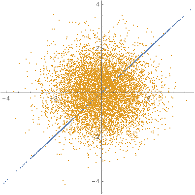

# Overview
MCMC based on multi-particle Hamiltonian dynamics, or more appropriately called "Maxwell Hamiltonian Monte Carlo"
# Codebase for
* "A Multi-Trajectory Monte Carlo Sampler"
* "Robust Inference Based On the Complementary Hamiltonian Monte Carlo"

# Examples

* example.nb
* Sampler.wl

# Theory

Total energy:

$H(q,p)=K(p,q)+U(q)$.

Hamiltonian Dynamics:

$\dot{q}=H_{p}=K_{p}$,

$\dot{p}=-H_{q}=-U_{q}-K_{q}$.

Euler integration:

$q_{1}= q_{0}+ \delta\times K_{p}(p_{0},q_{0})$,

$p_{1}= p_{0} - \delta\times \left( U_{q}(q_0)+K_{q}(p_0,q_0) \right)$.

The Kinetic energy $K_r$:

$K_{r}(p,q):=K(p,q;r)=\frac{1}{2}p^{T}\cdot U_{qq}^{-r}\cdot p$.

For simplicity, $r$ is a runtime parameter (unlike $K_p$ and $K_q$).

Because $r$ can be a decimal, Eigen decomposition is carried out:

$U_{qq}=V\cdot\Lambda\cdot{}V^{T}$.

For non-positive (and positive) definite Hessian:

$U_{qq}^{-r}:=V\cdot(\left|\Lambda\right|^{-r} \odot \text{sign}(\Lambda)\cdot{}V^{T}$,

or

$U_{qq}^{-r}:=V\cdot \left|\Lambda\right|^{-r} \cdot{}V^{T}$.

Which one is better?

The kinetic energy function that enables correct sampling of multivariate normal distributions may be $K_{0.5}$.

Simulation:

If the total energy of a multi-particle system is conserved, then after collition, a particle moves to a new position with a certain probability. it is obvious that the particle can move back with the same probability, i.e. :

$P(q_{0 } \to q_{1}) = P(q_{1 } \to q_{0})$.

Sampling:

Thus, the Metropolis algorithm's acceptance probability can be utilized to determine if a particle moves to the new position:

$\alpha=e^{U(q_{0})-U(q_{1})}$.

# Usage

1. Load the sampler.

```
SetDirectory[NotebookDirectory[]];
<< "Sampler`";
```
2. Ignore the $K_q$ (optionally) to speed up computation. 

```
Kq[p_, q_, r_] = 0;
```

3. Define the potential energy, i.e. the negative logarithm of probability density function, e.g. a bivariate normal distribution with $\Sigma$:

$$\Sigma=\left(
\begin{array}{cc}
 1 & 0.999999999999999 \\
 0.999999999999999 & 1 \\
\end{array}\right)$$

```
rho = 1 - 1/10^15;
SIGMA = {{1, rho}, {rho, 1}};
U[x_, y_] = 1/2 Simplify[{x, y}.LinearSolve[SIGMA, {x, y}]];
```
4. Define the derivative functions. 

```
Uq[x_, y_] = D1[U[x, y], {x, y}];
Uqq[x_, y_] = D2[U[x, y], {x, y}];
Uqqq[x_, y_] = D3[U[x, y], {x, y}];

```

5. Run the sampler with $K_{0.5}$.
```
Dim = 2;
BURNIN=5000;
ITERATIONS=10000;
QS = hmc[U, Uq, Uqq, Uqqq, Dim, BURNIN, ITERATIONS, {.5}, {}];
```

6. Check the result.

```
QS1 = QS.MatrixPower[SIGMA, -.5];
StandardDeviation[QS1]
ListPlot[{QS, QS1}, PlotStyle -> Opacity[1], AspectRatio -> 1, PlotLegends -> {Samples, Transformed}]
```

> {0.99964, 1.0068}



# Additional

+ For difficult models, several kinetic energies can be adopted, e.g.:

```
QS = hmc[U, Uq, Uqq, Uqqq, Dim, BURNIN, ITERATIONS, {.45,.5,.55}, {}];
```

+ The "complementary hamiltonian monte carlo", i.e. using $K_0$ and $K_1$:

```
QS = hmc[U, Uq, Uqq, Uqqq, Dim, BURNIN, ITERATIONS, {0, 1}, {}];
```

+ Run-time parameter can be set:

```
CHAINS=5;
STEPS=6;
```

+ Flat prior can be implemented by setting a reject region, e.g.:

```
outbnd[q_] := q[[-1]] <= 0;
```

+ Provide initial value.

```
qinit = RandomVariate[UniformDistribution[], {CHAINS, Dim}];
QS = hmc[U, Uq, Uqq, Uqqq, Dim, BURNIN, ITERATIONS, {.5}, qinit];
```

+ A remark on a naive question (there are __many more__ others)
>To reveal the problems of MCMC methods, quantitative experiments based on multivariate normal distribution can be used.

# Reference
+ For MCMC: Statistical Mechanics Algorithms and Computations
+ For HMC: Information Theory, Inference, and Learning Algorithms

# Acknowledgement
I had been thinking about this topic alone for years and have received polarized feedback, with headaches :-)

Some nice advice came from Prof. Andrew Gelman.

The idea of multi-particle jumped into my mind in Winnipeg when I was working on some research projects for Dr. Christopher Henry. The method of kinetic energy $K_r$ was developed in collaboration with Prof. Hongji Yang.

A few colleagues of *Capital of Statistics* (COS, editor Yu Miao) read the early draft.

I would also like to thank my mentors and friends for their encouragement years ago: Xu Hongbing of the University of Electronic Science and Technology, Shang Laiyou of Inner Mongolia Normal University, ...
# Citation
```
@ARTICLE{9585691,
  author={Xu, Xiaopeng and Liu, Chuancai and Yang, Hongji},
  journal={IEEE Transactions on Reliability}, 
  title={Robust Inference Based On the Complementary Hamiltonian Monte Carlo}, 
  year={2022},
  volume={71},
  number={1},
  pages={111-126},
  doi={10.1109/TR.2021.3117189}
  }
```
```
  @ARTICLE{ammcs,
  author={Xu, Xiaopeng and Liu, Chuancai and Yang, Hongji and Zhang, Xiaochun},
  journal={Journal of Internet Technology}, 
  title={A Multi-Trajectory Monte Carlo Sampler}, 
  year={2022},
  month={September}
  volume={23},
  number={5},
  pages={1117-1128},
  doi={10.1109/TR.2021.3117189}
  }
```
