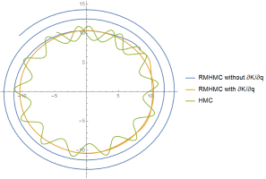

mcmc:

Gradient descent, Newton, and Anti-GD, or HMC, RMHMC, and Anti-HMC trajectories:

with ∂K/∂q or without ∂K/∂q:

1. the system is consisted of (a few if CPU, many if CUDA) particles
2. these particles can exchange energy by colliding virtually
3. the energy of the whole system is conserved
4. use "metropolis" algorithm
5. tune parameter automatically
6. use both trajectories

demonstrated with:
* Linear Programming
* Nonstationary Non-Poisson Process
* Cox's Proportional Hazard Model
* Jelinski–Moranda
* change point model
* hierarchical model
* Weibull
* missing data
* Bayesian Networks
